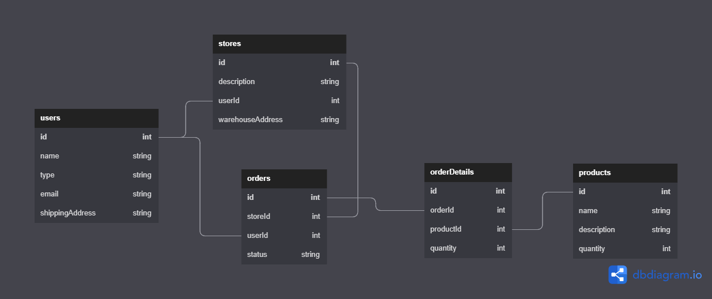
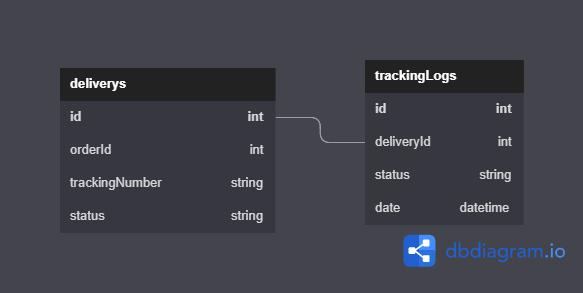

## Nodejs Sequelize RESTAPI MySQL

This is a REST API using Javascript Technologies and MySQL and handle 2 microservice projects ecommerce and delivery

- nodeJs
- express
- mysql
- sequelize

## Modeling

This is relationship of ecommerce microservice



This is relationship of delivery microservice



## How to run

### Requirements
- Docker installed

### Installation and execution
- Clone or Fork the project.

Run ```docker-compose``` command.

* Building the containers: ```docker-compose build```

* Starting the services: ```docker-compose up -d```

* Stoping the services: ```docker-compose stop```

By default the microservices will run under the following ports:
- ecommerce-service: 8000
- delivery-service: 8001

Check the **.env.example** file to change these or any other params.
#### Note

The NodeJS application will probably throw an exception the first time, because it will try to connect to the MySQL service that is still initializing for the first time; in this case wait for MySQL to fully initialize first and then run the command `docker-compose restart $NAME_SERVICE` in another terminal to restart the crashed service.

### Testing ⚙️

For test import all postman collection on postman inside of request folder and run in this order:
- User
- Store
- Product
- Order
- Delivery

### Autores ✒️

* **Autor:** Paul G. Ottenwalder, paulguillermo19@gmail.com


